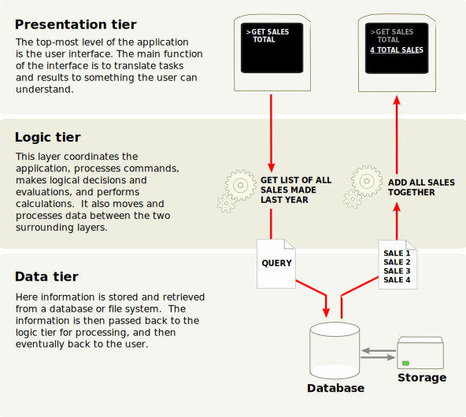

# `Chapter 1: Architecture Overview`

## Tutorial Development

* `Chapter 1: Architecture Overview`
* `Chapter 2: Development environment setup`
* `Chapter 3: A New Application`
* `Chapter 4: Models And Basic Fields`
* `Chapter 5: Security - A Brief Introduction`
* `Chapter 6: Finally, Some UI To Play With`
* `Chapter 7: Basic Views`
* `Chapter 8: Relations Between Models`
* `Chapter 9: Computed Fields And Onchanges`
* `Chapter 10: Ready For Some Action?`
* `Chapter 11: Constraints`
* `Chapter 12: Add The Sprinkles`
* `Chapter 13: Inheritance`
* `Chapter 14: Interact With Other Modules`
* `Chapter 15: A Brief History Of QWeb`
* `Chapter 16: Polish Your Code And Submit Your PR`

# Getting Started

kita segera mulai pembelajaran development Odoo! kita akan belajar untuk mengembangkan modul Odoo kita sendiri.

Tujuan dari tutorial ini adalah agar kita dapat mendapatkan wawasan tentang bagian terpenting dari kerangka pengembangan Odoo sambil mengembangkan modul Odoo kita sendiri untuk mengelola aset [real estate]. ada berberapa Bab yang harus sesuai urutannya karena mencakup pengembangan aplikasi Odoo secara bertahap.

Dengan kata lain, setiap bab bergantung pada bab sebelumnya.

ayo kita mulai


# Multitier application


odoo mengikuti aturan yang namanya `multitier architecture`_, ini berarti Presentasi Visual, Logika bisnis, dan penyimpanan Data dibuat terpisah. Secara umum gambaran ada di gambar berikut bahwa arsitektur dengan basis tiga layer (tingkat lapis)
(image from Wikipedia):

 { align=center }

``` py linenums="1"
The presentation tier --> adalah kombinasi dari HTML5, JavaScript & CSS.
The logic tier --> secara khusus di tulis dengan Python
The data tier --> hanya support PostgreSQL sebagai manajamen database RDBMS.
```

Depending on the scope of your module, Odoo development can be done in any of these tiers.
Therefore, before going any further, it may be a good idea to refresh your memory if you don't have
an intermediate level in these topics.

In order to go through this tutorial, you will need a very basic knowledge of HTML and an intermediate
level of Python. Advanced topics will require more knowledge in the other subjects. There are
plenty of tutorials freely accessible, so we cannot recommend one over another since it depends
on your background.

For reference this is the official `Python tutorial`_.

.. note::
  Since version 15.0, Odoo is actively transitioning to using its own in-house developed `OWL
  framework <https://odoo.github.io/owl/>`_ as part of its presentation tier. The legacy JavaScript
  framework is still supported but will be deprecated over time. This will be discussed further in
  advanced topics.

## Odoo modules


Both server and client extensions are packaged as *modules* which are
optionally loaded in a *database*. A module is a collection of functions and data that target a
single purpose.

Odoo modules can either add brand new business logic to an Odoo system or
alter and extend existing business logic. One module can be created to add your
country's accounting rules to Odoo's generic accounting support, while
a different module can add support for real-time visualisation of a bus fleet.

Everything in Odoo starts and ends with modules.

Terminology: developers group their business features in Odoo *modules*. The main user-facing
modules are flagged and exposed as *Apps*, but a majority of the modules aren't Apps. *Modules*
may also be referred to as *addons* and the directories where the Odoo server finds them
form the ``addons_path``.

### Composition of a module
